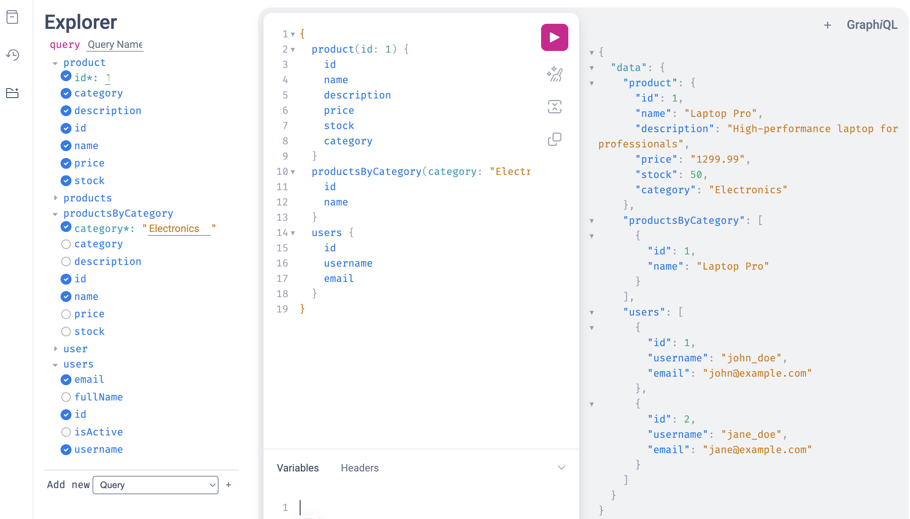

# GraphQL Microservices Demo

This project demonstrates how to use GraphQL as a gateway to combine multiple microservices.



## Prerequisites

- Python 3.10 or higher
- Docker and Docker Compose
- uv package manager (`pip install uv`)

## Project Structure
```
graphql-microservices-demo/
├── src/
│ ├── users_service/      # User management REST service
│ ├── products_service/   # Product catalog REST service
│ ├── graphql_gateway/    # GraphQL API gateway
│ └── common/             # Shared utilities
├── pyproject.toml        
└── docker-compose.yml    
```

## Build and start all services
```
docker compose up --build
```

## Access the services

- GraphQL Playground: http://localhost:8000/graphql
- Users Service: http://localhost:8001
- Products Service: http://localhost:8002

### Example Queries
```
graphql
query {
  # Get all users
  users {
    id
    username
    email
  }
  
  # Get all products
  products {
    id
    name
    price
    category
  }
  
  # Get products by category
  productsByCategory(category: "Electronics") {
    name
    price
    stock
  }
}
```
